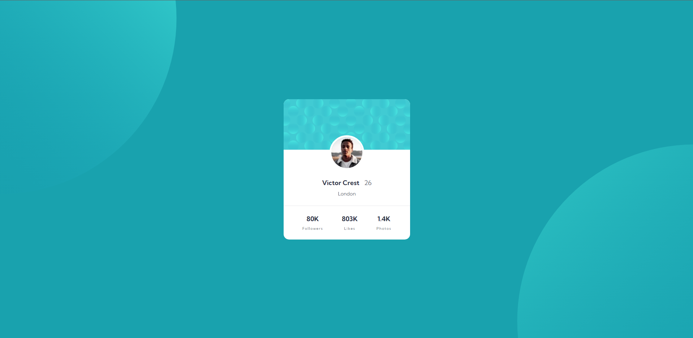
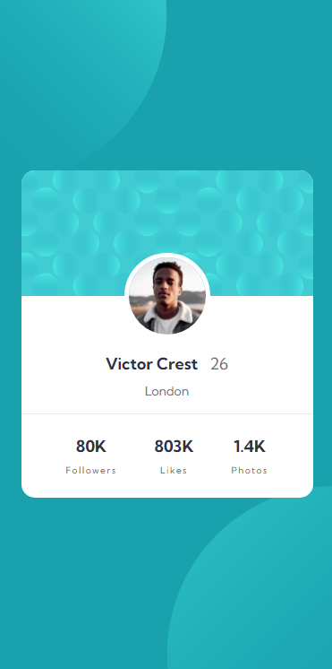

# Frontend Mentor - Profile card component solution

This is a solution to the [Profile card component challenge on Frontend Mentor](https://www.frontendmentor.io/challenges/profile-card-component-cfArpWshJ). Frontend Mentor challenges help you improve your coding skills by building realistic projects.

## Table of contents

- [Overview](#overview)
  - [The challenge](#the-challenge)
  - [Screenshot](#screenshot)
  - [Links](#links)
- [My process](#my-process)
  - [Built with](#built-with)
  - [Continued development](#continued-development)
  - [Useful resources](#useful-resources)
- [Author](#author)
- [Acknowledgments](#acknowledgments)

## Overview

### The challenge

- Build out the project to the designs provided

### Screenshot

### Links

- Solution URL: [Add solution URL here](https://your-solution-url.com)
- Live Site URL: [Add live site URL here](https://your-live-site-url.com)

## My process

### Built with

- Semantic HTML5 markup
- CSS custom properties
- Flexbox
- Mobile-first workflow

### Useful resources

- [MDN CSS transform](https://developer.mozilla.org/en-US/docs/Web/CSS/transform) - This helped me with the positioning of the background patterns
- [MDN Accessibility](https://developer.mozilla.org/en-US/docs/Web/Accessibility) - This helped me with the accessibility

## Author

- Github - [@carolsemeao](https://www.github.com/carolsemeao)
- Frontend Mentor - [@carolsemeao](https://www.frontendmentor.io/profile/carolsemeao)
- LinkedIn - [@carolinasemeao](https://www.linkedin.com/in/carolina-semeao)

## Acknowledgments

Give this challenge a try. It's very beginner friendly and you can learn how to use CSS Flexbox by doing this

- [Abdul Khalid](https://www.frontendmentor.io/profile/0xAbdulKhalid) - Thank you very much for the advice for placing the background images in a way better way
